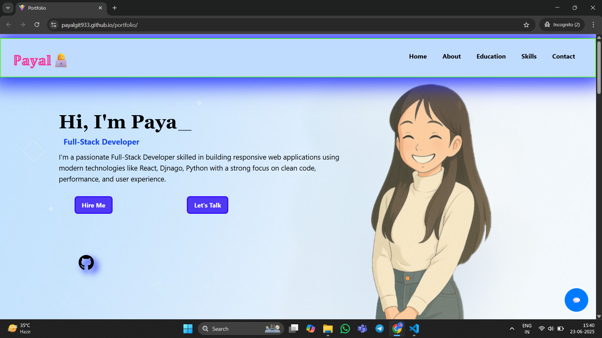
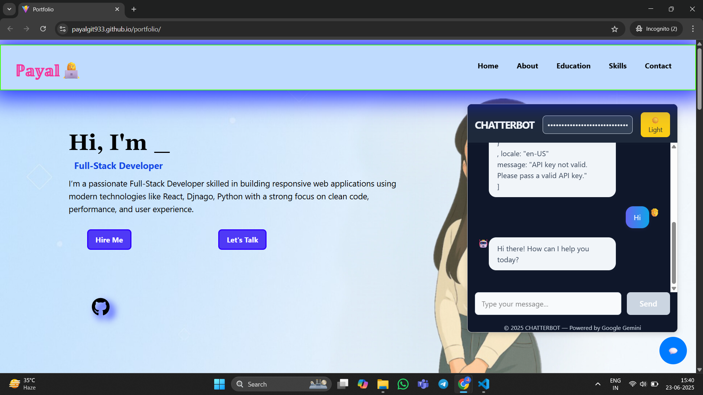

# portfolio

# 💻 Payal's Portfolio

Welcome to my personal portfolio website built with **React** and **Tailwind CSS**!  
This project showcases my educational background, skills, and contact information in a clean and responsive design.

---

## 🚀 Features

- ✨ Interactive and animated UI
- 📚 Education timeline
- 🛠️ Skills slider (using Swiper.js)
- 📬 Contact section with floating form and icons
- 📱 Fully responsive
- 🌈 Clean, modern design

---

## 🛠️ Tech Stack

- **Frontend:** React.js
- **Styling:** Tailwind CSS
- **Icons:** React Icons
- **Slider:** Swiper.js

---
# Demo



## 📦 Installation

```bash
git clone https://github.com/payalgit933/your-portfolio-repo.git
cd your-portfolio-repo
npm install
npm install react-router-dom
npm install swiper
npm run dev
